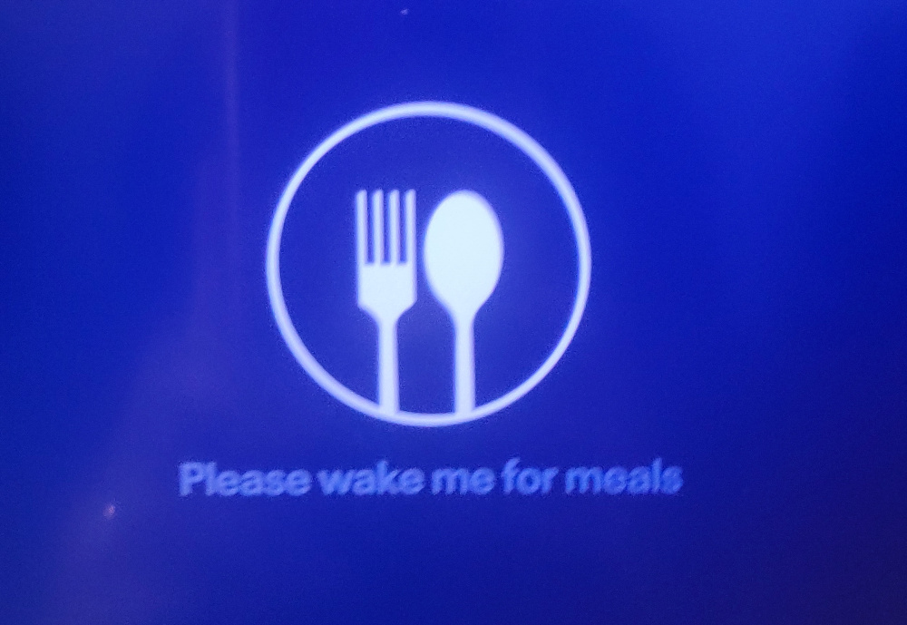

What makes you _hungry_?

No, I'm not talking about food. I mean "hungry" in the broader sense.
Let me explain.

Have you haver taken a 12-hour flight? The experience usually goes a little bit
like this. You're sitting in an uncomfortable position, with your leg space
shrunk to the minimum the airline could get without breaking avionics regulation
or the Geneva convention. Oftentimes, someone loud is seated in the row right
behind yours. You might attempt to find some solace in the media tablet embedded
in the seat in front of you, but that rarely works out. The luckiest thing that
can happen to falling asleep, exhausted, and fast-forward to the landing.

Some airlines however, allow you to set a note on the aforementioned tablet
with a polite but direct message

{ loading=lazy width=50% style='display: block; margin-left: auto; margin-right: auto; width: 80%; max-width: 600px' }

That is convenient if you're hungry enough that you want to interrupt that
blissful nap that you're taking. But what could make you _that_ hungry?

For me that's code.

Elegant code, ugly code. Working code, buggy code. Any code!

My name is Francesco and this is my blog.

---
