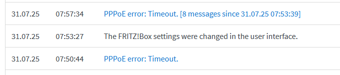
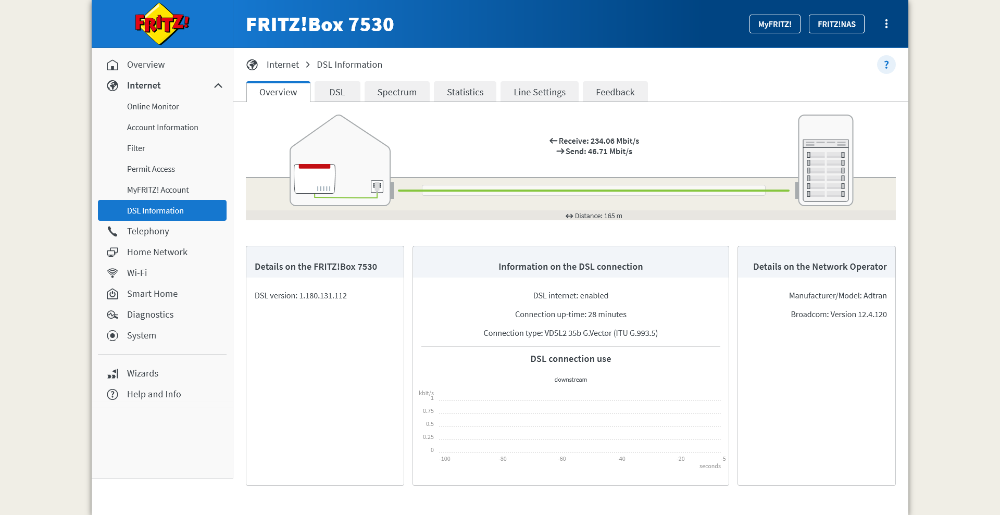
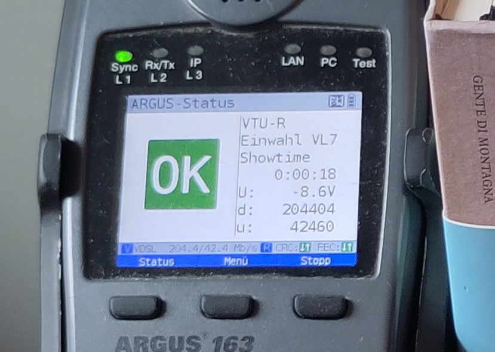

<!-- CHECKS:
- present time
- first person
-->

# Datagrams must be this tall to ride

About that time my ISP was dropping IP datagrams of a certain size.

<!-- more -->

## Entrée

It's July 2025. The end of the month is nearing, and my 2-year-long Internet
Service Provider (ISP) contract is bound to expire.

Here in Germany, ADSL contracts are not cheap. Luckily, you can save a
non-negligible amount of money if you sign up for a 2-year contract. This kind
of contract typically has an initial period of time in which you get a
discounted monthly fee. I'm talking about a _big_ discount. As big as 3x lower
fees for the first 12 months. After the initial period, the fee goes back to
normal, but you can't cancel the contract before the end of the 2nd year. On
average, you save some money, but you must endure the annoyance of switching to
a different ISP after the second year.

So I set to find a new ISP and, thanks to [Check24
website](https://www.check24.de/), found the ISP with the best offer of the
month: Maingau Energie.

{ loading=lazy }
/// caption
The homepage of Maingau Energie
///

The company is small compared to the German telecom titans, but their reviews
seem solid. Also, Maingau Energie does not force you to buy or rent their ADSL
modem. Cherry on top: they explicitly mentioned my current ADSL modem, a second
hand [FRITZ!Box 7530](https://fritz.com/en/pages/service-fritz-box-7530), as
compatible.

So I subscribed. Little did I know about what I was really signing up for.

After a couple of weeks, I get an appointment for a technician to setup the ADSL
line. As they leave my house, I'm already firing up the FRITZ!Box admin panel
and setting up the ADSL parameters and PPPoE credentials. I'm expecting now to
see what my new public IP looks like but instead I get...

{ loading=lazy }
/// caption
The FRITZ!Box logs show a PPPoE timeout.
///

Uhm. Strange.

Looking closer at the admin panel, I can confirm that the ADSL training has
completed fine, and no error is reported.

{ loading=lazy }
/// caption
The ADSL status page shows that the connection was established successfully.
///

suggesting that the physical link and the ADSL parameters are working. I double
check all the configurations, the credentials, and the physical connections, but
nothing changes. I leave it alone for some time, hoping it's just some network
configuration that has not yet propagated fully. After a few days, I try a hard
reset of the ADSL modem and repeat the whole process once more. But alas, PPPoE
still shows no signs of life.

I then decide to reach to technical support via email. I detail my issues,
attaching screenshots of the current configuration, the ADSL status, and the the
error I face. Soon, I get a new technician appointment. I learn from the
technician that they know nothing about PPPoE, and that the only thing they can
do is to check the quality of the ADSL connection with a handheld device. This
is not at all different from the one the first technician used when they setup
the line. So, I'm very little surprised when my ADSL line turns out to be
working fine.

{ loading=lazy }
/// caption
An ADSL testing device shows that the ADSL works fine.
///

I take a photo of the test result and forward it to the Maingau technical
support. Surely, now that the ADSL functionality has been confirmed, they will
be looking at the PPPoE issue on their syst..

{ loading=lazy }
/// caption
An email from Maingau technical support communicates that the issue is resolved.
///

or, as GMail automatic translation puts it

> Dear Ladies and Gentlemen,
>
> Your fault with the number "MAING-XXXXXXXXXXXXXX" has been set to the status
> "Resolved" and is therefore closed.

I try multiple times to contact customer support to convince them that no, the
issue is not resolved, and that yes, I've tried rebooting the ADSL router.

Exasperated, I decide it's time I try to do something on my own.

## Warming up

You see, the nice thing about my FRITZ!Box 7530 router is that it has OpenWRT
support. Malignant minds might think that I have been dying for an excuse to rip
out the stock firmware and install OpenWRT.

Flashing OpenWRT was a piece of cake, also thanks to 
[the very detailed page of the OpenWRT wiki](https://openwrt.org/toh/avm/avm_fritz_box_7530).
I then started combining the ADSL parameters provided by my ISP with the many
examples [in the wiki](https://openwrt.org/docs/guide-user/network/wan/isp-configurations).
After a little bit of trial and error, I found the right network configuration for my VDSL connection:

```
config atm-bridge 'atm'
    option vpi '1' # Specified by the ISP
    option vci '32' # Specified by the ISP
    option encaps 'llc'
    option payload 'bridged'
    option nameprefix 'dsl'

config dsl 'dsl'
    option annex 'j'
    option tone 'b'
    option ds_snr_offset '0'

config device
    option name 'dsl0'

config device
    option type '8021q'
    option ifname 'dsl0'
    option vid '7' # VLAN ID 7, as specified by ISP
    option name 'dsl0.7'

config interface 'wan'
    option device 'dsl0.7'
    option proto 'pppoe'
    option username '$ISP_PROVIDED_USERNAME'
    option password '$ISP_PROVIDED_PASSWORD'
```

and that... worked! No PPPoE timeout, an IP address was negotiated and I could
finally connect to the internet! Hell I even got an IPv6 address.

So all is good now, right? Right??

## A bitter taste

So I start surfing, but something is off. Sometimes, website fail to load.
Software updates don't go through. In most cases, the issues are intermittent,
almost forgivable. But in other cases the issues reproducing consistently.

Here are a few exmaples:

- On a Debian box, `docker login ghcr.io` would _always_ fail

- On all Windows laptops, `winget update` was failing with the error message

```
TODO: add winget command and error message
```

- The `steamcommunity.org` website wouldn't load,

I decided to analyze the `steamcommunity.org` failure in more detail. I picked
this issue in particular because it can be reproduce from a browser, which has
very many useful tools to inspect network requests.

I open Chrome, I fire the developers tools, select the Network tab, and ensure
the "disable cache" checkbox is selected. I reload the page and, indeed, I find
that there is a specific asset that fails to be transferred, resulting the
website styling not loading.

TODO: Add picture

One of the key features of the Network tab is that, for every network request,
it can produce an equivalent curl command. I do exactly that by right-clicking
on the request and hit the "Copy" > "Copy as curl (cmd) TODO" option.

This gives me a big curl command, with plenty of options.

```cmd
TODO
```

I expect some of these headers might be required for the remote host to behave
in the same way, so I run it as-is. Sure enough I can reproduce the error:

```
  % Total    % Received % Xferd  Average Speed   Time    Time     Time  Current
                                 Dload  Upload   Total   Spent    Left  Speed
  0     0    0     0    0     0      0      0 --:--:--  0:00:19 --:--:--     0
curl: (52) Empty reply from server
```

Then I try to minimize the reproduction type further, removing all the headers
that I suspect are not _really_ required. So I run it again and...

```
TODO
```

```

```

The request... works!

Wait, what?

Ok now, time to think.

Explanation 1; perhaps the second request got answered by a different remote
host? For good measure, I hardcode the IP of the host in the Windows HOSTS file.
But the results still reproduce.

Explanation: Perhaps _all_ the headers are required for the request to be
accepted by the reverse proxy? What if instead of removing headers, I add some?
This might be troublesome because the remote load balancer might strip my
request of any non-standard HTTP header, or even block the request. Well let's
try with a few options:

```
TODO script
```

```
Length  3 (X-1):  TIMEOUT
Length  4 (X-11):  TIMEOUT
Length  5 (X-111):  success
Length  6 (X-1111):  success
Length  7 (X-11111):  TIMEOUT
Length  8 (X-111111):  success
Length  9 (X-1111111):  TIMEOUT
Length 10 (X-11111111):  TIMEOUT
Length 11 (X-111111111):  success
Length 12 (X-1111111111):  success
Length 13 (X-11111111111):  success
Length 14 (X-111111111111):  success
Length 15 (X-1111111111111):  success
Length 16 (X-11111111111111):  success
Length 17 (X-111111111111111):  success
Length 18 (X-1111111111111111):  success
Length 19 (X-11111111111111111):  success
Length 20 (X-111111111111111111):  success
```

Ok, but what if I change the content of the header?

```
TODO  code
```

```
  X-ABCDEFGH:  TIMEOUT
  Y-12345678:  TIMEOUT
  Custom1234:  TIMEOUT
  Headerasdf:  TIMEOUT
  X-TEST1234:  TIMEOUT
  MyHeader34:  TIMEOUT
```

It seems that the precise content of the header does not matter. It's the length
of the request that matters. 

To determine which are the request lengths that trigger the issue, I extend the
script to repeat the request over and over for a range of values, obtaining the
following image.

{ loading=lazy }
/// caption
TODO
///

This might explain why the issue occurs often, but not always. But why is the
request failing in the first place?

## Dissecting packets

Ok, it's time too look more closely at these network requests. In order to
capture the traffic on the DSL device, I fire up
[WireShark](https://www.wireshark.org/) on my laptop and install `tcpdump` on
the router with

```sh
opkg install tcpdump
```

Then I configure WireShark to connect via SSH to the router. Note that the
filtering rules here follow the `tcpdump` notation, which is slightly different
from the language to specify WireShark's filters.

I take a specific request and run it twice, once while connected to my ADSL and
once while connected to my mobile hotspot, and compare the two captures.

TODO: capture + breakdown

So I end up with a bunch of re-transmissions. But why? Is it because the ACK for
my request never gets there, or is it because the network response never comes
back?

TODO: Add graphical diagram

I can not capture packets as the server side. Unless..

## The ultimate test

Ok so the idea is to deploy a small Virtual Machine on the cloud, connect to it
via my ISP, and capture the traffic on both sides and see what exactly goes
missing.

TODO: Setup

{ loading=lazy }
/// caption
TODO
///

TODO: Breakdown

For curiosity, I try the same test using ping. Ping sends ICMP packets rather
than TCP ones, but they too have a payload and its length can be configured with
the `-s` flag. Interestingly, the same failure pattern occurs.

TODO: 

> Did they ever fit together?

https://youtu.be/-JIuKjaY3r4?t=203

So the common denominator between the two tests, is not anything at the Network
Layer, the Layer 3 of the ISO model. It's further down to Layer 2, where IP
reigns supreme.


# Unfolding the symptoms

The issue is that packets sent from my ADSL router to the internet never get
delivered if their size is within a specific size.

TODO: Add diagram of issue


# Drafting possible solutions

How to work around the issue?

My first attempt was to filter outbound packets on the router so that they are
split if they have a size matching one of the "forbidden" ones.

Pros:
- only requires processing on the sending side
- tested successfully without ping

Cons:
- sometime TCP packets are not allowed to be split

## Solution Attempt 2: Artificially increase datagram size

# Packet inflater

# Packet shrinker


## Conclusions

* Maingau Energie sucks

Follow-up work: 
* Use eBPF instead
* extend to IPv6


\*[ISP]: Internet Service Provider 
\*[VDSL]: Very high speed Digital Subscriber Line
