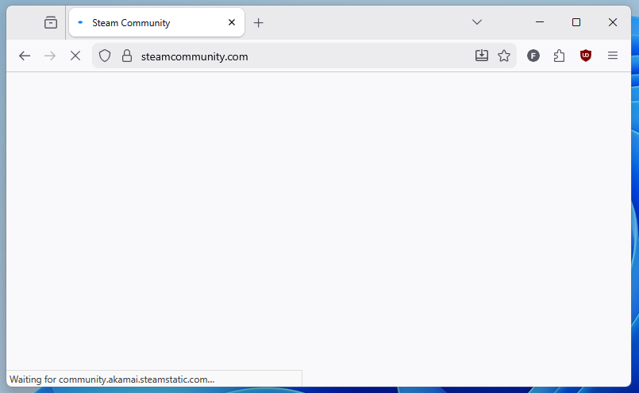
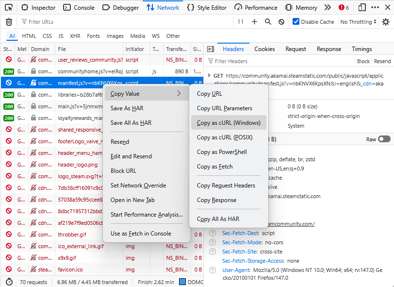
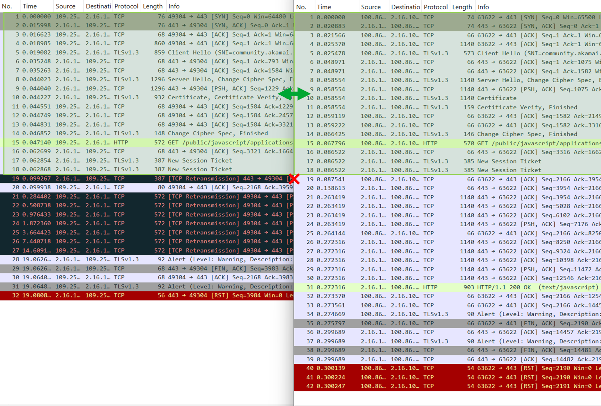
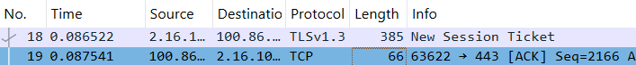
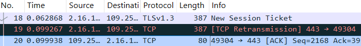
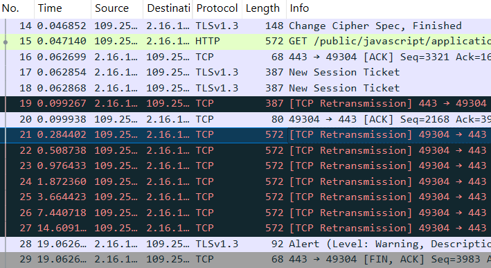
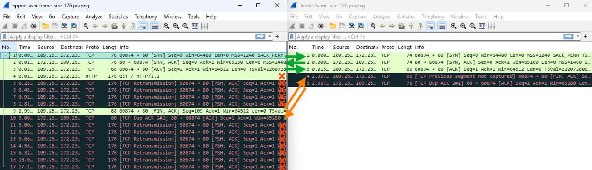

<!-- CHECKS:
- present time
- first person
-->

# Datagrams must be this tall to ride

Or what to do when your ISP drops IP datagrams of certain sizes.

<!-- more -->

## Entrée

It's July 2025. The end of the month is nearing, and my 2-year-long Internet
Service Provider (ISP) contract is bound to expire.

Here in Germany, ADSL contracts are not cheap. Luckily, you can save a
non-negligible amount of money if you sign up for a 2-year contract. This kind
of contract typically has an initial period of time in which you get a
discounted monthly fee. I'm talking about a _big_ discount. As big as 3x lower
fees for the first 12 months. After the initial period, the fee goes back to
normal, but you can't cancel the contract before the end of the 2nd year. On
average, you save some money, but you must endure the annoyance of switching to
a different ISP after the second year.

So here I am looking, for a new ISP to switch to and. Thanks to
[Check24 website](https://www.check24.de/), I find the ISP with the best offer
of the month: Maingau Energie.

{ loading=lazy }
/// caption
A happy family of Maingau Energie customers. Note how nobody in the promotional
picture seems to be actually accessing the internet.
///

The company is not one of the renowned German telecom titans, but

- the customers reviews on Check24 seem solid
- Maingau Energie does not force you to buy or rent their ADSL
  modem
- They explicitly mentioned my current ADSL modem, a second hand
  [FRITZ!Box 7530](https://fritz.com/en/pages/service-fritz-box-7530), as
  compatible.

So I sign up. Little do I know about what I am _really_ signing up for.

After a couple of weeks, I get an appointment for a technician to setup the ADSL
line. As the technician leavse my house, I'm already firing up the FRITZ!Box
admin panel and setting up the ADSL parameters and PPPoE credentials. I'm
expecting now to see what my new public IP looks like but instead I get...

{ loading=lazy }
/// caption
The FRITZ!Box logs show a PPPoE timeout.
///

Uhm. Strange.

Looking closer at the admin panel, I can confirm that the ADSL "training" has
completed fine, and no error is reported.

{ loading=lazy }
/// caption
The ADSL status page shows that the connection was established successfully.
///

I double-check and redo all the configurations, the credentials, the physical
connections... nothing changes. Finally, I decide to leave the router alone for
some time. I tell myself: "Perhaps it's just some network configuration that has
not yet propagated fully".

After a few days, I try to hard-reset the ADSL modem and repeat the whole
process once more. But alas, the PPPoE device on the other side of the
connection still shows no signs of life.

I then decide to reach out to technical support via email. I detail my issues,
attaching screenshots of the current configuration, the ADSL status, and the
error I am facing. Soon, another new technician appointment is scheduled.

But when the technician arrives, they know nothing about the PPPoE
configuration. The only thing they can do is to check the quality of the ADSL
connection with a handheld device. This is not at all different from the one the
first technician used when they setup the line. So, I'm very little surprised
when my ADSL line turns out to be fine. Unfortunately, the fact that the ADSL
connectivity work is not sufficient to conclude that my internet connection is
working.

{ loading=lazy }
/// caption
An Argus 163 ADSL testing device shows that the ADSL works fine. Notice how the
German word for "stop" is spelled with two "p"s.
///

I forward a photo of the test results to the Maingau technical support. Surely,
now that the ADSL functionality has been confirmed, they will be looking at the
PPPoE issue on their syst..

{ loading=lazy }
/// caption
An email from Maingau technical support declares the issue resolved.
///

or, as GMail automatic translation puts it

> Dear Ladies and Gentlemen,
>
> Your fault with the number "MAING-XXXXXXXXXXXXXX" has been set to the status
> "Resolved" and is therefore closed.

I try multiple times to contact customer support via phone or email to convince
them that no, the issue is not resolved, and that yes, I've tried rebooting the
ADSL router. Nobody takes my problem at heart.

Exasperated, I decide it's time I try to do something on my own.

## Warming up

By default, the router gives little information for any investigation. But the
nice thing about my FRITZ!Box 7530 router is that it has ✨OpenWRT support✨.

> Malignant minds might think that I have been dying for an excuse to rip
> out the stock firmware and install OpenWRT on my router. They are not wrong.

I head to [the OpenWRT wiki page dedicated to my
router](https://openwrt.org/toh/avm/avm_fritz_box_7530), I follow the flashing
procedure, and soon the router becomes _truly_ mine. I then start combining the
VDSL parameters provided by my ISP with the many examples
[in the wiki](https://openwrt.org/docs/guide-user/network/wan/isp-configurations).
After a little bit of trial and error, I conjure the following configuration:

```
config atm-bridge 'atm'
    option vpi '1' # Specified by the ISP
    option vci '32' # Specified by the ISP
    option encaps 'llc'
    option payload 'bridged'
    option nameprefix 'dsl'

config dsl 'dsl'
    option annex 'j'
    option tone 'b'
    option ds_snr_offset '0'

config device
    option name 'dsl0'

config device
    option type '8021q'
    option ifname 'dsl0'
    option vid '7' # VLAN ID 7, as specified by ISP
    option name 'dsl0.7'

config interface 'wan'
    option device 'dsl0.7'
    option proto 'pppoe'
    option username '$ISP_PROVIDED_USERNAME' # Specified by the ISP
    option password '$ISP_PROVIDED_PASSWORD' # Specified by the ISP
```

and that... worked! No PPPoE timeout! An IP address is negotiated and I can
finally connect to the internet! Hell, I even got an IPv6 address.

So all is good now, right?

Right??

## Bitter taste

I start surfing, but something is off. Sometimes, website fail to load. In most
cases, the issues are intermittent, almost forgivable. But in other cases the
issues reproduce consistently.

Here are a few examples:

- On a Debian box, `docker login ghcr.io` _always_ fails with `TLS handshake
timeout`

```
$ echo test | docker login ghcr.io -u USERNAME --password-stdin
Error response from daemon: Get "https://ghcr.io/v2/": net/http: TLS handshake timeout
```

- On all Windows devices, `winget update` was failing with the error message

```
PS C:\> winget update --all
Errore durante la ricerca nell'origine: 'msstore'
Si è verificato un errore imprevisto durante l'esecuzione del comando:
WinHttpSendRequest: 12002: Timeout dell'operazione

0x80072ee2 : unknown error
```

> _**Side Question:**_
> _Honestly, how do you force PowerShell to show error messages in English? On
> Linux, I would just set the `LC_ALL=C` environment variable. On Windows, is
> the only option to change the system language and reboot the machine?_

- The `steamcommunity.org` website doesn't load,

  { loading=lazy }
  /// caption
  The steamcommunity.org website fails to load.
  ///

I decide to investigate the `steamcommunity.org` failure first, since:

1. The issue can be reproduced from a browser, which has very many useful tools
   to inspect network requests,
2. I really wanted to replay Patrician III.

I open Firefox, start the developers tools, switch to the "Network" tab, and
ensure the "disable cache" checkbox is selected. I reload the page and, indeed,
I find that there is a specific asset that fails to be transferred, resulting
the website styling not loading.

TODO: Add picture of the network tab showing that the manifest.js asset does not load.

One of the key features of the Network tab is that, for every network request,
it can produce an equivalent `curl` command. In this way, the reuqest can be
reproduced exactly from a terminal prompt. I do exactly that by right-clicking
on the request and hit the "Copy" > "Copy as cURL (Windows)".

{ loading=lazy }
/// caption
To whoever came up with this feature: I owe you a beer.
///

This gives me a big and noisy `curl` command that I paste into a `cmd`
prompt and run

```
C:\>curl.exe ^"https://community.akamai.steamstatic.com/public/javascript/applications/community/manifest.js?v=nbKNVX6KpsXN^&l=english^&_cdn=akamai^" ^
   -H ^"User-Agent: Mozilla/5.0 (Windows NT 10.0; Win64; x64; rv:147.0) Gecko/20100101 Firefox/147.0^" ^
   -H ^"Accept: */*^" ^
   -H ^"Accept-Language: en-US,en;q=0.9^" ^
   -H ^"Accept-Encoding: gzip, deflate, br, zstd^" ^
   -H ^"Sec-Fetch-Storage-Access: none^" ^
   -H ^"Connection: keep-alive^" ^
   -H ^"Referer: https://steamcommunity.com/^" ^
   -H ^"Sec-Fetch-Dest: script^" ^
   -H ^"Sec-Fetch-Mode: no-cors^" ^
   -H ^"Sec-Fetch-Site: cross-site^" ^
   -H ^"Priority: u=2^" ^
   -H ^"Pragma: no-cache^" ^
   -H ^"Cache-Control: no-cache^" ^
   -O NUL

curl: (52) Empty reply from server
```

All right, the error can be reproduced. Let's now try to minimize the command.
Surely, not all of these headers are _really_ needed. So I remove the last
`-H ...` command line option, and get...

```
C:\>curl.exe ^"https://community.akamai.steamstatic.com/public/javascript/applications/community/manifest.js?v=nbKNVX6KpsXN^&l=english^&_cdn=akamai^" ^
     -H ^"User-Agent: Mozilla/5.0 (Windows NT 10.0; Win64; x64; rv:147.0) Gecko/20100101 Firefox/147.0^" ^
     -H ^"Accept: */*^" ^
     -H ^"Accept-Language: en-US,en;q=0.9^" ^
     -H ^"Accept-Encoding: gzip, deflate, br, zstd^" ^
     -H ^"Sec-Fetch-Storage-Access: none^" ^
     -H ^"Connection: keep-alive^" ^
     -H ^"Referer: https://steamcommunity.com/^" ^
     -H ^"Sec-Fetch-Dest: script^" ^
     -H ^"Sec-Fetch-Mode: no-cors^" ^
     -H ^"Sec-Fetch-Site: cross-site^" ^
     -H ^"Priority: u=2^" ^
     -H ^"Pragma: no-cache^" ^
     -o NUL

  % Total    % Received % Xferd  Average Speed   Time    Time     Time  Current
                                 Dload  Upload   Total   Spent    Left  Speed
100  9061  100  9061    0     0  91644      0 --:--:-- --:--:-- --:--:-- 94385
```

a successful response.

Wait, what?! I just remove a random header and everything works?

Ok now, time to think:

- Rationalization attempt #1: Perhaps the second request got answered by a
  different remote host? For good measure, I hardcode the IP of the host in the
  Windows HOSTS file and retry. But even after that, the results are the same.
  Also, replaying the request any number of times does not change the outcomes.

- Rationalization attempt #2: Maybe the issue is exactly the header I decided to
  remove? But no, even without any of the other headers, the request succeeds.

Ok, I'll admit I'm a bit clueless by now. So let's try to investigate some more
to try and make sense of the situation.

What if instead of removing an HTTP header, I add one? Well, this might create
more troubles: the website's load balancer might strip my request of any HTTP
header it does not expect, or even reject the request completely. I try using a
header name with the conventional `X-` name prefix to increase the chances of my
request not being rejected. Also, I'll use a Bash run from WSL from now on,
because I'm more familiar with the syntax.

```bash
#!/bin/bash

# run_curl: Sends the same HTTP request that fails in the browser, but also
#           adding any extra HTTP header that is passed in as argument.
function run_curl() {
    timeout 3 curl -s -o /dev/null \
        -H 'User-Agent: Mozilla/5.0 (Windows NT 10.0; Win64; x64; rv:142.0) Gecko/20100101 Firefox/142.0' \
        -H 'Accept: */*' \
        -H 'Accept-Language: en-US,en;q=0.5' \
        -H 'Accept-Encoding: gzip, deflate, br, zstd' \
        -H 'Connection: keep-alive' \
        -H 'Referer: https://steamcommunity.com/' \
        -H 'Sec-Fetch-Dest: script' \
        -H 'Sec-Fetch-Mode: no-cors' \
        -H 'Sec-Fetch-Site: cross-site' \
        "$@" \
        'https://community.akamai.steamstatic.com/public/javascript/applications/community/manifest.js?v=PU33sk4crNva&l=english&_cdn=akamai'
}

# Repeat the HTTP request with an extra, dummy header of increasing length. The
# header has the form:
#
#   X-1...1: a
#
# with the number of '1' characters varying from 3 to 20
for LENGTH in {3..20}; do
    # Build the header name and value
    HEADER_NAME="X-$(printf '%0*d' $((LENGTH-2)) 1 | tr '0' '1')"

    printf "Header \"%s\" (Length %2d): " "$HEADER_NAME" "$LENGTH"

    run_curl -H "$HEADER_NAME: a"

    RESULT=$?  # Get the exit code of the last command
    if [ $RESULT -eq 0 ]; then
        echo " success"
    elif [ $RESULT -eq 124 ]; then
        echo " TIMEOUT"
    else
        echo " FAILED"
    fi
done
```

```txt
Header "X-1" (Length 3): TIMEOUT
Header "X-11" (Length 4): TIMEOUT
Header "X-111" (Length 5): success
Header "X-1111" (Length 6): success
Header "X-11111" (Length 7): TIMEOUT
Header "X-111111" (Length 8): success
Header "X-1111111" (Length 9): TIMEOUT
Header "X-11111111" (Length 10): TIMEOUT
Header "X-111111111" (Length 11): success
Header "X-1111111111" (Length 12): success
Header "X-11111111111" (Length 13): success
Header "X-111111111111" (Length 14): success
Header "X-1111111111111" (Length 15): success
Header "X-11111111111111" (Length 16): success
Header "X-111111111111111" (Length 17): success
Header "X-1111111111111111" (Length 18): success
Header "X-11111111111111111" (Length 19): success
Header "X-111111111111111111" (Length 20): success
```

The results show that when the header has a length of 3, 4, 7, 9, or 10
characters the request fails with a timeout. In all other cases, the request
succeeds.

To make sure the header value does not affect the outcome, I run another test
with a bunch of random values, but fixed length.
In all cases, the timeout still occurs.

```
X-ABCDEFGH:  TIMEOUT
Y-12345678:  TIMEOUT
Custom1234:  TIMEOUT
Headerasdf:  TIMEOUT
X-TEST1234:  TIMEOUT
MyHeader34:  TIMEOUT
```

Conclusion: the content of the header does not matter. It's the _length_ of the
header that does.

To determine which are the request lengths that trigger the issue, I extend the
script to repeat the request over and over for a wider range of values. Also, to
reduce the chance of flukes, I repeat each test 5 times. I then plot a graph
showing the percentage of failures for a given requested size.

{ loading=lazy }
/// caption
TODO
///

Is that.. a pattern?

## Dissecting packets

So far I have managed to investigate more about the conditions in which the
request timeout is observed. However I still don't know _why_ the timeouts
occur. It's time too look more closely at the network traffic.

In order to capture network traffic of the DSL device, I need to install
`tcpdump` on the router. Thanks to OpenWRT, this is as simple as running

```sh
opkg install tcpdump
```

I then fire up Wireshark on my laptop and
configure it to connect via SSH to the router following [this guide](https://jmwoccassionalnotes.blog/2025/03/04/wireshark-remote-capture-over-ssh/).

I proceed capture the network traffic on my router while running the `curl`
command from my laptop. To have a reference of what the "normal" traffic should
look like, I also capture the traffic obtained while connected to a mobile
hotspot rather than my ADSL router.

{ loading=lazy }
/// caption
The network traffic captured when connecting through the ADSL router (left side,
public IP `109.25.X.X`) and through the mobile hotspot (right side, public IP
`100.86.X.X`). In both captures, the same resource is retrieved from the remote
server with IP `2.16.X.X`.
///

By comparing the two captures, I can conclude that the network traffic looks
exactly the same up until packet No. 18. Instead, from packet No. 19 on, the
network traffic starts to diverge:

- When connected to the mobile hotspot (right side): Packet No. 19 is an
  acknoledgment (`ACK`) packet that my laptop (Source IP `100.86.X.X`) sends to
  the remote server. The packet means that the laptop confirms the correct
  reception of all TCP segments transmitted by the remote server up to and
  including packet No. 18 (Wireshark helpfully shows a small "✔️" symbol next to
  packet No. 18 when packet No. 19 is selected).

  { loading=lazy }

  After this, the remote server (IP `2.16.X.X`) sends Packet No. 20,
  acknowledging the HTTP request in Packet No. 15.

  { loading=lazy }

  Then, it proceeds to send the HTTP response.

- Instead, when connected to the ADSL router (left side), packet No. 19 is a TCP
  Retransmission packet that the remote host (Source IP `2.16.X.X`) sends to my
  laptop to request an explicit acknoledgment of the data received this far. The
  packet has the TCP Push (`PSH`) flag set, requesting that my laptop answer
  immediately rather than buffering its response.
  My laptop honors the request immediately with packet No. 20, which
  acknowledges all the data transmitted by the remote server up to and including
  packet No. 18.

  { loading=lazy }

  Somehow, however, the remote server does not answer after that. Evidently, its
  waiting for my laptop to do something. After a few milliseconds of stalling,
  my laptop realizes, and decides to retransmit the oldest packet that the
  remote server has not acknoledged yet, packet No. 15.

  { loading=lazy }

  This can also be confirmed by looking at the packet size, which is 572 for
  both packets No. 15 and 21.

  But gets nothing back.

  In an incredible display of patience and perseverance, my laptop keeps
  retransmitting the same packet over and over (packets No. 22 through 27), over
  the course of 14 seconds of pure suspence.

  Eventually, the remote server gives up and closes the TCP transaction by
  sending packet No. 29 with a `FIN` flag. Enigmatically, the last packets from
  the remote server do not specify if any of the retransmitted packets has ever
  been received.

But why is this happening? I see two possible explanations:

- either the packets sent by my laptop do not reach the remote server, or
- the `ACK`s from the remote do not reach my laptop.

TODO: Add graphical diagram

To rule out any of the two, we'd need to get the packet capture on the remote
side as well. Unfortunately, it's unlikely that Akamai is willing to provide
that to me.

What else can be done then?

## The ultimate test

Ok so the idea is to deploy a small Virtual Machine (VM) on the cloud, connect to it
via my ISP, and capture the traffic on both sides and see what exactly goes
missing.

{ loading=lazy }
/// caption
The TCP packets captured on my ADSL router (left side, IP `109.250.XX.XX`) and on the remote VM (right side, IP `172.238.XX.XX`).
///

I have added arrows to link together matching packets on the right and left sides. The direction of the arrow indicates the travelling direction of the packet.

Here is my reconstruction of the exchange, following the packet numbering of the left pane:

- ✅ Packets No. 1 to 3 are exchanged correctly.
- ❌ Packet No. 4 only appears in the left pane (indeed, there is no packet with protocol
  "HTTP" in the right pane), indicating that it never reached its destination.
  Note that it has the "cursed" frame size 176.
- ❌ Packets No. 5 to 8 are all attempts at retransmitting packet No. 4. In all
  cases, the retransmission does not reach its destination. It is not a
  coincidence that because they also have the "cursed" frame size.
- ⚠️ `curl` reaches the 3-second timeout specified in the script and closes the
  connection with packet No. 9, which has the `FIN` flag on. The packet is
  received correctly by the remote VM and is also visible in the right pane
  (perhaps because it does not have a "cursed" size). The packet has the
  Sequence number 109, which the VM did not expect. Wireshark kindly highlights that in the right pane by showing the label `Previous segment not captured` in the "Info" column.
- ⚠️ Since the Sequence number is off, the remote VM sends back Packet No. 9., signaling that it can not aknowledge the `FIN` request, since something in the middle is missing.
- ❌ The client then tries to re-send the packet multiplt times, but all subsequent TCP retransmissions also fail, having the same "cursed" size.

This test confirms that the issue affects outgoing packets travelling from my
network to the outside Internet. But not all packets are affected. It seems that the packet size is significant in determining the outcome, but what about the packet protocol?

# The last piece of the puzzle

So far all tests where based on TCP packets. I decide to try a similar test using `ping`, which uses ICMP packets instead. Luckily, ICMP packets can also have a payload, and its length can be configured with
the `-s` option. Interestingly, the same failure pattern occurs.

TODO:

> Did they ever fit together?

https://youtu.be/-JIuKjaY3r4?t=203

This test is interesting because it shows that both the TCP and ICMP requests
(which differ wildly in content) are affected in the same way. This suggests
that the root cause is not at Layer 3 of the ISO model.

It's further down to Layer 2, where IP reigns supreme.

# Drafting possible solutions

To summarize the above findings, my issue is that IP datagrams sent from my ADSL
router to the Internet are outright dropped if their size matches one of the
"cursed" sizes.

TODO: Add diagram of issue

How to address the issue?

One possiblity is to perform some packet manipulation on outbound packets to
change their size and save the from a terrible destiny.

I first come up with the idea of reducing the size of the "cursed" packets by
applying IP fragmentation. This is quite simple to implement, the fragmentation
feature that is already available in IP. Additionally, if the source host
fragments the IP packets it sends, the destination host will automatically
recombine the fragments.

I managed to implement the first approach, and I was even able to make the
`ping` requests work. However, the are some situations where packets are not
allowed to be fragmented (for example, TCP packets used in TLS handshakes can
not be fragmented for security concerns)

If reducing the packet size is not possible, then what about increasing it?

An IPv4 packet is composed of:

- an IPv4 header,
- an IPv4 payload.

Unfortunately, the size of the IPv4 payload can not be increased without also
affecting how the inner Layer 3 packets are parsed.

On the other hand, the IPv4 header size is not fixed! The IPv4 standard allows
the IP header to have a variable number of "options", whose size can range from
0 to 40 bytes with steps of 4 bytes.

{ loading=lazy }
/// caption
By Michel Bakni - Postel, J. (September 1981) _RFC 791, IP Protocol, DARPA
Internet Program Protocol Specification_, p. 1 DOI:
[10.17487/RFC0791](dx.doi.org/10.17487/RFC0791), CC BY-SA 4.0,
https://commons.wikimedia.org/w/index.php?curid=79949694
///

So a possiblity is to add a sufficient number of IP header options so that the
overall IP datagram size does not match any of the cursed sizes.
Unfortunately, IP header options are rarely used in the general Internet and intermediate routers often drop IPv4 packets specifying options.

# Packet inflater

# Packet shrinker

## Conclusions

- Maingau Energie sucks

Follow-up work:

- Use eBPF instead
- extend to IPv6

## Acknoledgements

Thanks to the folks in the OpenWRT forum for listening to my crazy ravings.

\*[ISP]: Internet Service Provider \*[VDSL]: Very high speed Digital Subscriber Line
